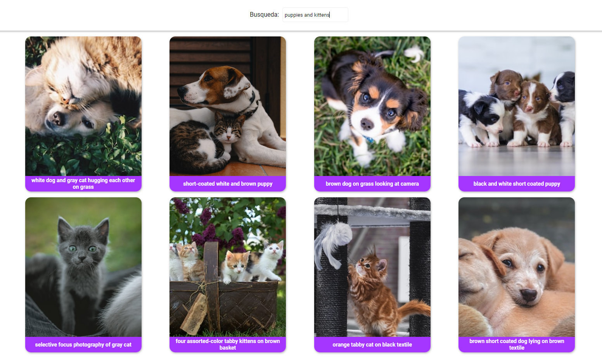

# Image App

### Whats all about?

This app is consuming an API. You can look for an image and see the results

### Screenshot

### Links

- Solution URL: [https://github.com/veronicajujuy/cipboard-landing-page](https://github.com/veronicajujuy/buscador-imagenes)
- Live Site URL: [Add live site URL here](https://buscador-imagenes-indol.vercel.app/)

## My process

### Built with

- React JS
- Flexbox
- Formik

### What I learned

I'm using react Context for the global state management.

## Author

- Vero
